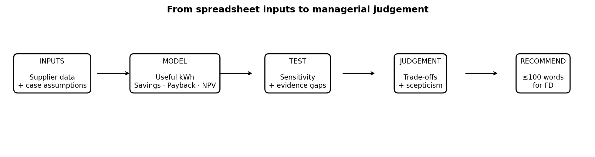

```{=html}
<div class="embed-utility"><a href="https://marcelmare.com/dla-course-2/" target="_blank" rel="noopener">Open course in new window ↗</a></div>

<nav class="stage-progress" aria-label="Course progress">
<a data-progress-page="index" class="" href="index.html">Start</a>
<a data-progress-page="understand" class="" href="understand.html">Understand</a>
<a data-progress-page="spreadsheet-essentials" class="" href="spreadsheet-essentials.html">Spreadsheets</a>
<a data-progress-page="build" class="active" href="build.html">Build</a>
<a data-progress-page="test" class="" href="test.html">Test</a>
<a data-progress-page="decide" class="" href="decide.html">Decide</a>
<a data-progress-page="reflect" class="" href="reflect.html">Reflect</a>
</nav>

<div class="page-visual"></div>

<div class="message"><div class="meta">09:40 · Financial Director</div>
<strong>Before we discuss NPV, give me a clean Year-1 comparison.</strong>
<p>I want to see what each system produces economically, what it saves after maintenance, and how quickly the capital is recovered. Keep the model traceable to the source data.</p></div>

<section class="obe"><div class="obe-head">Purpose → Outcome → Activity → Evidence</div><div class="obe-body">
<p><strong>Purpose of this stage:</strong> convert supplier and case data into comparable financial measures using an auditable spreadsheet structure.</p>
<p><strong>Outcome for this stage:</strong> <strong>Construct an auditable spreadsheet model that converts operational solar data into comparable Year-1 financial measures.</strong></p>
<p><strong>You will demonstrate this by:</strong> calculating useful generation, gross and net Year-1 savings and simple payback; applying relative and absolute references appropriately; formatting outputs consistently; and creating a decision-relevant visual.</p>
<p><strong>Evidence:</strong> completed <span class="cell">Your Model!B4:D8</span>, one comparison chart and a one-sentence visual-design rationale.</p>
</div></section>

<div class="platform-note">
  <div class="label">Excel + Google Sheets · Build</div>
  <p><strong>All formulas on this page are identical.</strong> Enter them in the same cells and copy them across in the same direction.</p>
  <div class="platform-grid">
    <div class="platform"><strong>Excel formatting</strong>Select <span class="cell">B5:D6</span> → Home → Number and choose Currency/Accounting. Select <span class="cell">B7:D7</span> and show two decimal places.</div>
    <div class="platform"><strong>Google Sheets formatting</strong>Select <span class="cell">B5:D6</span> → Format → Number → Currency (or use the currency toolbar button). Select <span class="cell">B7:D7</span> → Format → Number → Number and set two decimal places.</div>
  </div>
</div>

<div class="thread"><strong>Story so far:</strong> You understand the inputs and have entered your first formula. Now complete the chain from operating data to payback.</div>

<section class="story"><div class="label">The case · The Financial Director wants comparable numbers</div>
<h2>Turn three supplier proposals into one auditable model</h2>
<p>Management needs a common basis for comparison. Build the logic in the <strong>Your Model</strong> sheet: useful generation → gross saving → net saving → simple payback.</p></section>

<div class="card"><div class="step"><div class="num">1</div><div><h3>Useful generation — already started</h3>
<div class="formula">Useful generation = Year-1 generation × self-consumption</div>
<p><strong>Cells:</strong> <span class="cell">Your Model!B4:D4</span></p>
<p><strong>System A formula in B4:</strong></p><div class="formula">='Case Data'!B15*'Case Data'!B16</div>
<p>Copy <span class="cell">B4</span> across to <span class="cell">D4</span>. Relative references should change automatically.</p></div></div></div>

<div class="card" style="margin-top:12px"><div class="step"><div class="num">2</div><div><h3>Gross Year-1 saving</h3>
<div class="formula">Gross saving = useful generation × tariff</div>
<p>Select <span class="cell">Your Model!B5</span> and enter:</p>
<div class="formula">=B4*'Case Data'!$B$4</div>
<p>Copy across to <span class="cell">D5</span>. The first reference changes B4 → C4 → D4; the tariff stays locked at <span class="cell">Case Data!$B$4</span>.</p>
<details><summary>Formative feedback · check values</summary><p>B5 = R231,840; C5 = R287,980; D5 = R321,048.</p></details></div></div></div>

<div class="card" style="margin-top:12px"><div class="step"><div class="num">3</div><div><h3>Net Year-1 saving</h3>
<div class="formula">Net saving = gross saving − maintenance</div>
<p>In <span class="cell">Your Model!B6</span> enter:</p><div class="formula">=B5-'Case Data'!B17</div>
<p>Copy across to <span class="cell">D6</span>. Format <span class="cell">B6:D6</span> as rand currency.</p>
<details><summary>Formative feedback · check values</summary><p>B6 = R222,840; C6 = R276,980; D6 = R307,048.</p></details></div></div></div>

<div class="card" style="margin-top:12px"><div class="step"><div class="num">4</div><div><h3>Simple payback</h3>
<div class="formula">Simple payback = installed cost ÷ Net Year-1 saving</div>
<p>In <span class="cell">Your Model!B7</span> enter:</p><div class="formula">='Case Data'!B13/B6</div>
<p>Copy across to <span class="cell">D7</span>. Format <span class="cell">B7:D7</span> to two decimal places.</p>
<details><summary>Formative feedback · diagnose your result</summary><p>Your answers should be approximately A = 2.92, B = 2.96, C = 3.22 years. If not, check percentage formats, cell references, subtraction of maintenance, and numerator/denominator.</p></details></div></div></div>

<div class="excel"><div class="label">Optional Excel skill · rank the paybacks</div><h3>Use a function rather than ranking by eye</h3>
<p>In <span class="cell">Your Model!B8</span> enter:</p><div class="formula">=RANK.EQ(B7,$B$7:$D$7,1)</div>
<p>Copy across to <span class="cell">D8</span>. The final argument <span class="cell">1</span> means the smallest payback receives rank 1.</p>
<details><summary>Formative feedback · check ranks</summary><p>System A = 1, System B = 2, System C = 3.</p></details></div>

<div class="excel"><div class="label">Visual communication task</div><h3>Create one chart an executive can read in five seconds</h3>
<ol><li>Decide which single comparison your chart should communicate.</li><li>For a simple-payback chart, use proposal names <span class="cell">B3:D3</span> and payback values <span class="cell">B7:D7</span>.</li></ol>
<div class="platform-grid">
<div class="platform"><strong>Excel</strong>Select <span class="cell">B3:D3</span>, then add the non-adjacent <span class="cell">B7:D7</span> range using <span class="kbd">Ctrl</span> (Windows) or <span class="kbd">⌘</span> (Mac). Choose <strong>Insert → Column or Bar Chart → Clustered Column</strong>.</div>
<div class="platform"><strong>Google Sheets</strong>The simplest beginner route is to create a small temporary two-row chart source in unused cells (for example <span class="cell">H3:J4</span>): copy the three proposal names into row 3 and link row 4 to <span class="cell">B7:D7</span>. Select <span class="cell">H3:J4</span> → <strong>Insert → Chart</strong> → choose <strong>Column chart</strong> in the Chart editor. This avoids awkward non-adjacent selection.</div>
</div>
<ol start="3"><li>Give the chart a decision-focused title such as <strong>Simple payback by proposal</strong>.</li><li>Remove anything that does not help a manager compare the three systems.</li></ol>
<p><strong>Write one sentence:</strong> “I chose to show ___ because ___.”</p></div>

<div class="output"><strong>Evidence produced:</strong> completed <span class="cell">Your Model!B4:D8</span> + one chart + one-sentence design rationale.</div>

<div class="next"><strong>Next:</strong> management challenges an assumption. Test whether your conclusion survives.</div>

<nav class="iframe-nav app-nav" aria-label="Page navigation">
<a class="course-button alt app-link" href="spreadsheet-essentials.html">← Back</a>
<a class="course-button app-link" href="test.html">Next: Test the model →</a>
</nav>
```
