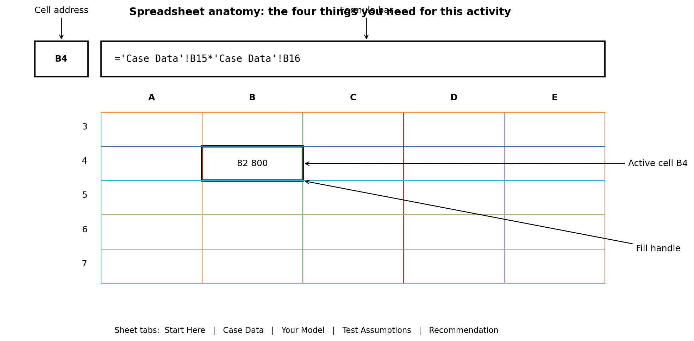





:::::: {.case-study aria-label="Cape Manufacturing case study: Prepare the working model"}
::: case-study-label
Case study · Cape Manufacturing · Prepare the working model
:::

You have reviewed the proposal inputs. Before completing the comparison, you prepare a working copy of the supplied workbook and establish the link between generation and self-consumption.

::::: case-message
::: {.case-avatar aria-hidden="true"}
FD
:::

:::: case-message-body
::: case-meta
Monday 09:20 · Financial Director
:::

## Make the analysis traceable from the first formula.

Keep the supplier inputs together and reference them in your calculations. I need to be able to follow each result back to its source.
::::
:::::
::::::

::: page-visual
{fig-alt="Annotated spreadsheet interface showing the course-critical controls"}
:::

::::: obe
::: obe-head
Enabling outcomes · spreadsheet readiness
:::

::: obe-body
**Purpose of this section:** provide the minimum spreadsheet skills needed to complete the investment analysis. No prior Excel proficiency is assumed.

**After completing this section, you should be able to:**

-   **identify** a cell using its column and row address;
-   **enter and edit** a formula;
-   **reference** data on another worksheet;
-   **distinguish and apply** relative, absolute and mixed references;
-   **copy** formulas accurately;
-   **apply** appropriate number formats; and
-   **inspect** a formula to identify a possible error.

**Evidence:** a correct first useful-generation calculation in `Your Model!B4:D4`{.cell} and successful readiness check.
:::
:::::

:::::::: platform-note
::: label
Platform guide · keep this beside you
:::

::::: platform-grid
::: platform
**Microsoft Excel**

-   Start a formula: type `=`{.cell}.
-   Edit a cell: double-click it or use the Formula Bar.
-   Copy a formula: drag the fill handle; `Ctrl+D`{.kbd} fills down on Windows.
-   Cycle relative/absolute references while editing: `F4`{.kbd}; on Mac, `F4`{.kbd} or `⌘T`{.kbd} depending on keyboard settings.
-   Undo: `Ctrl+Z`{.kbd} / `⌘Z`{.kbd}.
:::

::: platform
**Google Sheets compatibility**

-   Start a formula: type `=`{.cell}.
-   Edit a cell: double-click it or use the formula bar.
-   Copy a formula: drag the fill handle; `Ctrl+D`{.kbd} fills down and `Ctrl+R`{.kbd} fills right on Windows/ChromeOS.
-   Cycle relative/absolute references while editing: `F4`{.kbd}; on many Macs use `Fn+F4`{.kbd}.
-   Undo: `Ctrl+Z`{.kbd} / `⌘Z`{.kbd}. Changes are saved automatically.
:::
:::::

::: same
**Same conceptual rule:** `B15`{.cell} is relative, `$B$4`{.cell} is absolute, and `$A8`{.cell} fixes only the column. Dollar signs have the same meaning in both applications.
:::
::::::::

:::: course-context
::: label
Excel bridge · just enough Excel to start modelling
:::

## You do not need to know Excel before continuing

You need five moves: select a cell, enter a formula, reference another sheet, copy a formula across, and format a result. You will practise each move on the actual Cape Manufacturing workbook.
::::

::::::: grid2
::: card
### 1 · Cells and addresses

Columns use letters; rows use numbers. Their intersection is a cell. `B4`{.cell} means column B, row 4.

Click **Case Data!B4**. The Name Box identifies the active cell.
:::

::: card
### 2 · Formulas begin with =

Excel calculates only when an entry begins with `=`{.cell}.

Example: `=2+3`{.cell} returns 5. In this course, however, you will reference cells rather than type business inputs into formulas.
:::

::: card
### 3 · Referencing another sheet

A reference such as `'Case Data'!B15`{.cell} means “use the value in cell B15 on the Case Data sheet”.

The quotation marks appear because the sheet name contains a space.
:::

::: card
### 4 · Relative vs absolute

`B15`{.cell} is relative: copied one column right, it becomes `C15`{.cell}.

`$B$4`{.cell} is absolute: copied anywhere, it remains B4. Use this for the shared tariff.
:::
:::::::

:::::: excel
::: label
Guided practice · your first live formula
:::

### Calculate System A useful generation

1.  Click the **Your Model** sheet.
2.  Select the yellow cell `B4`{.cell}.
3.  Type exactly:

::: formula
`='Case Data'!B15*'Case Data'!B16`
:::

4.  Press `Enter`{.kbd}. You should see **82,800**.
5.  Click `B4`{.cell} again. Move the pointer to the small square at the bottom-right corner of the selection (the fill handle). Both Excel and Google Sheets use this control.
6.  Drag the fill handle across to `D4`{.cell}. In Google Sheets you can alternatively select `B4:D4`{.cell} and use **Fill right** / `Ctrl+R`{.kbd} where supported. Excel should adapt the relative references for Systems B and C.

Check your answer

`B4 = 82,800`{.cell}, `C4 = 102,850`{.cell}, `D4 = 114,660`{.cell}.

::::::

:::: excel
::: label
Formatting essentials
:::

### Values and presentation are different things

-   Use **Currency/Accounting** formatting for rand amounts.
-   Use **Percentage** formatting for rates such as 90%.
-   Use **Number** with two decimal places for payback years.
-   Do not type “R”, “%” or “years” into numeric cells; use number formats so Excel can still calculate with the values.
::::

::: warn
**If you make a mistake:** use Undo (`Ctrl+Z`{.kbd} on Windows; `⌘Z`{.kbd} on Mac). A formula can always be edited in the cell or Formula Bar.
:::

::: formative
**Completed:** you can now enter a formula, read a cross-sheet reference, copy a relative formula and recognise an absolute reference.
:::

::: next
**Next:** use those moves to complete the commercial model.
:::


