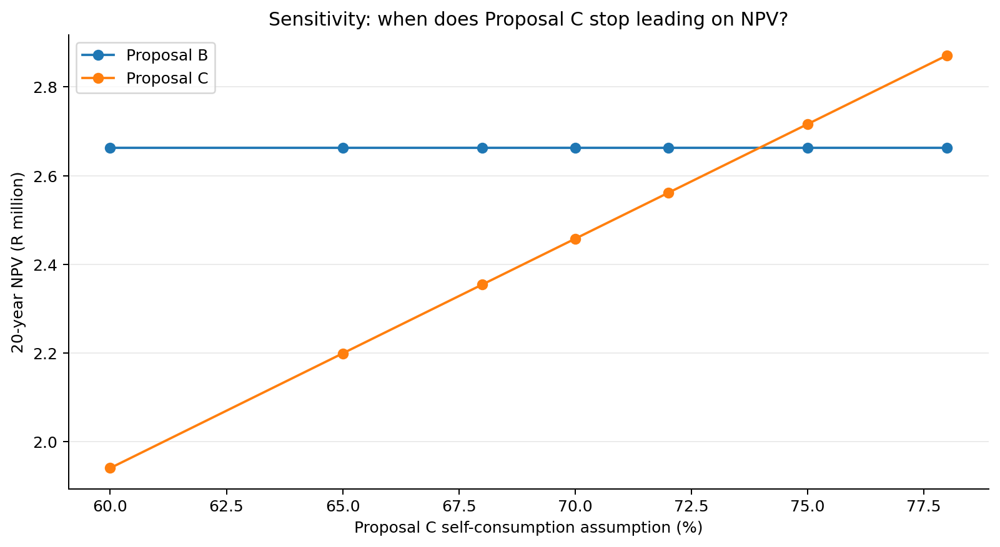

::: embed-utility
[Open course in new window ↗](https://marcelmare.com/dla-course-2/){target="_blank" rel="noopener"}
:::



:::::: {.case-study aria-label="Cape Manufacturing case study: Operations challenges the assumption"}
::: case-study-label
Case study · Cape Manufacturing · Operations challenges the assumption
:::

Your Year-1 comparison favours A for the fastest payback. The next question is long-term value: the supplied 20-year model puts C ahead under the base assumptions, but that result depends on how much solar output the factory can use.

::::: case-message
::: {.case-avatar aria-hidden="true"}
TJ
:::

:::: case-message-body
::: case-meta
Monday 13:15 · Thandi Jacobs · Production Manager
:::

### Will we really use 78% of System C’s output?

Production varies during the week. If we cannot use as much solar power at the time it is generated as Supplier C assumes, does C still offer the highest net present value (NPV)?
::::
:::::
::::::

::::: obe
::: obe-head
Purpose → Outcome → Activity → Evidence
:::

::: obe-body
**Purpose of this stage:** move beyond a single spreadsheet answer by testing whether the decision is robust to uncertainty.

**Outcome for this stage:** **Evaluate the sensitivity of an investment decision to a material operational assumption and interpret the implications for management.**

**You will demonstrate this by:** distinguishing payback from NPV; changing System C's self-consumption assumption; interpreting the resulting NPV changes; identifying the approximate crossover between Systems B and C; and identifying additional evidence required to validate the assumption.

**Evidence:** completed `Test Assumptions!A7:E14`{.cell}, crossover interpretation and an evidence requirement concerning the factory load profile.
:::
:::::

:::::::: platform-note
::: label
Excel + Google Sheets · Test
:::

The `SUMPRODUCT`{.cell}, `ROW`{.cell}, `MAX`{.cell}, `MATCH`{.cell} and `CHOOSE`{.cell} formulas below are written once and used unchanged in both applications.

::::: platform-grid
::: platform
**Excel** Enter formulas in `B8:E8`{.cell}; select the row and drag the fill handle down to row 14. Format `B8:D14`{.cell} as rand currency.
:::

::: platform
**Google Sheets** Enter the same formulas in `B8:E8`{.cell}; drag the fill handle down to row 14, or select `B8:E14`{.cell} and use **Fill down** / `Ctrl+D`{.kbd}. Format `B8:D14`{.cell} via Format → Number → Currency.
:::
:::::

::: same
**Do not “translate” the formulas.** Sheet names, apostrophes, dollar signs and cell addresses remain exactly as printed.
:::
::::::::

:::: course-context
::: label
Course guidance · compare payback and NPV
:::

## “Will we really use 78% of System C's output?”

Simple payback favours System A at about **2.92 years**. A 20-year discounted cash-flow view tells a different story: under the base assumptions, System C has the highest NPV at about **R2.871 million**.

Why? Payback focuses on recovery speed. NPV considers the value today of future net savings over the full analysis period.

Hold the assumptions for A and B fixed while varying C’s self-consumption. This isolates the effect of the operational uncertainty.
::::

:::: caseq
::: label
Decision question
:::

**Does System C still create the most long-term value if Cape Manufacturing cannot use as much of its solar output as the supplier expects?**
::::

:::::::: excel
::: label
Excel instruction · sensitivity table
:::

### Work on the Test Assumptions sheet

The scenario rates are already entered in `A8:A14`{.cell}: 78%, 75%, 72%, 70%, 68%, 65%, 60%.

Enter the following formulas in row 8. The formulas use `SUMPRODUCT`{.cell} to value 20 years of escalating savings, degradation, maintenance and discounting. For this short course, you are **using** the discounted-cash-flow engine rather than being assessed on constructing it from first principles.

**NPV A — Test Assumptions!B8**

::: formula
`=SUMPRODUCT(('Case Data'!$B$15*(1-'Case Data'!$B$7)^(ROW($1:$20)-1)*'Case Data'!$B$16*'Case Data'!$B$4*(1+'Case Data'!$B$5)^(ROW($1:$20)-1)-'Case Data'!$B$17*(1+'Case Data'!$B$8)^(ROW($1:$20)-1))/(1+'Case Data'!$B$6)^ROW($1:$20))-'Case Data'!$B$13`
:::

**NPV B — Test Assumptions!C8**

::: formula
`=SUMPRODUCT(('Case Data'!$C$15*(1-'Case Data'!$B$7)^(ROW($1:$20)-1)*'Case Data'!$C$16*'Case Data'!$B$4*(1+'Case Data'!$B$5)^(ROW($1:$20)-1)-'Case Data'!$C$17*(1+'Case Data'!$B$8)^(ROW($1:$20)-1))/(1+'Case Data'!$B$6)^ROW($1:$20))-'Case Data'!$C$13`
:::

**NPV C — Test Assumptions!D8**

::: formula
`=SUMPRODUCT(('Case Data'!$D$15*(1-'Case Data'!$B$7)^(ROW($1:$20)-1)*$A8*'Case Data'!$B$4*(1+'Case Data'!$B$5)^(ROW($1:$20)-1)-'Case Data'!$D$17*(1+'Case Data'!$B$8)^(ROW($1:$20)-1))/(1+'Case Data'!$B$6)^ROW($1:$20))-'Case Data'!$D$13`
:::

**Highest NPV — Test Assumptions!E8**

::: formula
`=CHOOSE(MATCH(MAX(B8:D8),B8:D8,0),"System A","System B","System C")`
:::

1.  After entering the four formulas in `B8:E8`{.cell}, select them.
2.  Drag the fill handle down through row 14. Because System C's formula uses `$A8`{.cell}, the scenario row changes while column A stays fixed.
3.  Format `B8:D14`{.cell} as rand currency with no decimals.
::::::::

| C self-consumption | Expected NPV C | Highest NPV |
|--------------------|----------------|-------------|
| 78%                | ≈ R2.871m      | System C    |
| 75%                | ≈ R2.716m      | System C    |
| 72%                | ≈ R2.561m      | System B    |
| 70%                | ≈ R2.458m      | System B    |
| 68%                | ≈ R2.355m      | System B    |
| 65%                | ≈ R2.199m      | System B    |
| 60%                | ≈ R1.941m      | System B    |

::::: formative
::: label
Formative checkpoint · find the crossover
:::

Compare columns `C`{.cell} and `D`{.cell} in rows `8:14`{.cell}. The switch occurs between 75% and 72%.

::: {.callout-note collapse="true"}
## Formative feedback · check your conclusion

System B overtakes System C at approximately **74%** self-consumption. The modelled crossover is about **73.96%**.
:::
:::::

:::: {.card .accent}
### Interrogate the assumption, not just the number

Which would be more useful for validating self-consumption: annual electricity consumption, or half-hourly load data aligned with expected solar production?

::: {.callout-note collapse="true"}
## Why half-hourly data?

Self-consumption depends on **when** electricity is used relative to solar generation. Annual totals can conceal a mismatch between midday PV production and the factory's load profile.
:::
::::

::: output
**Evidence produced:** completed sensitivity table `Test Assumptions!A7:E14`{.cell} and a reasoned view on the operational data management still needs.
:::

::: next
**Next:** turn conflicting evidence and uncertainty into an executive recommendation.
:::

::: page-visual
{fig-alt="Sensitivity crossover chart for Proposal C self-consumption"}
:::

:::: {#what-should-management-do-with-the-crossover-result .interactive}
### What should management do with the crossover result?



::: {#cross-feedback .formative hidden=""}
:::
::::


