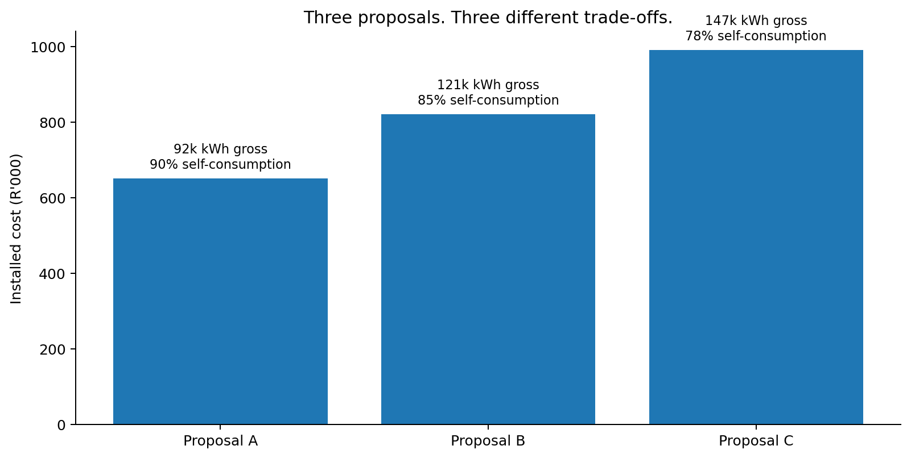

::: embed-utility
[Open course in new window ↗](https://marcelmare.com/dla-course-2/){target="_blank" rel="noopener"}
:::



:::: {#before-you-open-the-spreadsheet .interactive}
## Before you open the spreadsheet …

Which measure would you inspect first if you had to advise the Financial Director?



::: {#prediction-status .small-note}
Your choice is saved automatically on this device. You will revisit it on Reflect.
:::
::::

::: page-visual
{fig-alt="Three-proposal visual comparison"}
:::

::::: obe
::: obe-head
Purpose → Outcome → Evidence
:::

::: obe-body
**Purpose of this stage:** establish the commercial meaning of the supplier data before using the spreadsheet.

**Outcome for this stage:** After completing this stage, you should be able to **interpret the case data and explain how self-consumption affects the economic value of solar generation**.

**You will demonstrate this by:** distinguishing installed capacity, gross generation and useful generation; identifying the case assumptions; and explaining why a larger system is not automatically the better investment.

**Evidence:** your prediction response and concept-check explanation.
:::
:::::

::: thread
**Story so far:** You have accepted the brief. Before calculating, you need to understand what the supplier numbers mean.
:::

:::: story
::: label
The case · The proposals arrive
:::

## Price is only one part of the decision

A larger PV system can generate more electricity, but Cape Manufacturing only saves money on solar electricity it can use when it is produced. This makes **self-consumption** the bridge between technical output and economic value.

If a system generates 100 kWh while the factory can use only 80 kWh, its self-consumption is 80%. In this simplified case, unused generation has no economic value.
::::

| Proposal           | A          | B           | C           |
|--------------------|------------|-------------|-------------|
| Installed cost     | R650,000   | R820,000    | R990,000    |
| System size        | 60 kWp     | 80 kWp      | 100 kWp     |
| Year-1 generation  | 92,000 kWh | 121,000 kWh | 147,000 kWh |
| Self-consumption   | 90%        | 85%         | 78%         |
| Year-1 maintenance | R9,000     | R11,000     | R14,000     |

:::: excel
::: label
Excel instruction · read cells, do not calculate yet
:::

### Use the Case Data sheet as your source of truth

1.  Click the **Case Data** sheet.
2.  Economic assumptions are in `A3:E9`{.cell}. Click `B4`{.cell}: the Formula Bar should show **2.8**, the tariff in R/kWh.
3.  Proposal inputs are in `A12:F17`{.cell}. System A is column `B`{.cell}, B is `C`{.cell}, C is `D`{.cell}.
4.  Click `D15`{.cell} (147,000 kWh) and then `D16`{.cell} (78%). Note that the cell address changes in the Name Box.

**Useful habit:** never retype an input elsewhere if a formula can reference the original cell. This improves auditability and reduces inconsistent assumptions.
::::

:::: formative
::: label
Formative checkpoint · prediction before calculation
:::

If you had only 30 seconds, which metric would you look at first: **Installed Cost, Size, Gross Generation, Annual Saving, or Payback?**

Write down your choice and one reason. You will revisit it at the end.
::::

::: {.callout-note collapse="true"}
## Formative feedback · concept check: which system generates most, and which has highest self-consumption?

System C has the highest gross generation (147,000 kWh). System A has the highest self-consumption (90%). Those facts do not, by themselves, identify the best investment.
:::

::::::: platform-note
::: label
Excel + Google Sheets · same task
:::

::::: platform-grid
::: platform
**Excel** Use the sheet tabs at the bottom. Click a cell and read its address in the **Name Box**; read/edit the formula in the **Formula Bar**.
:::

::: platform
**Google Sheets** Use the sheet tabs at the bottom. Click a cell and read its address in the **Name box** at the left of the formula bar; read/edit the formula in the formula bar.
:::
:::::

For this page there is no platform-specific calculation. The cell references `Case Data!B4`{.cell}, `D15`{.cell} and `D16`{.cell} mean the same thing in both.
:::::::

::: next
**Next:** learn the few Excel moves needed to build the model confidently.
:::


